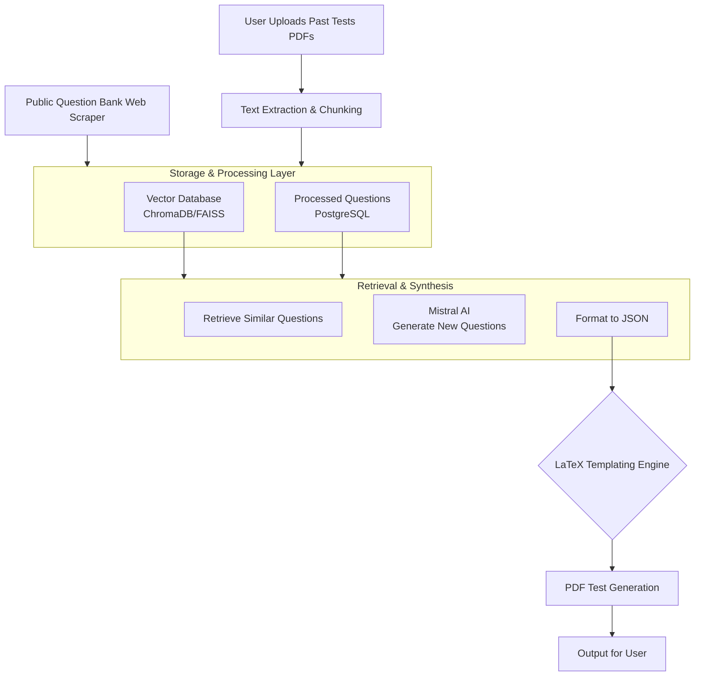

# MistralAIExamsGenerationApp
Instead of creating questions by yourself for an Exam let the App do this for you!


## App workflow



## Docker Build & Run Instructions

1. **Build the Docker image:**

   From the `frontend` directory:
   ```sh
   docker build -t mistral-exam-app .
   ```

2. **Run the container:**

   ```sh
   docker run -p 3000:3000 -p 8000:8000 mistral-exam-app
   ```
   - Frontend: http://localhost:3000
   - Backend/API: http://localhost:8000

3. **Environment Variables:**
   - Create a `.env` file in the same directory as your Dockerfile with:
     ```
     MISTRALAI_API_KEY=your_actual_api_key_here
     ```
   - The Dockerfile copies this `.env` file into the container.

---
