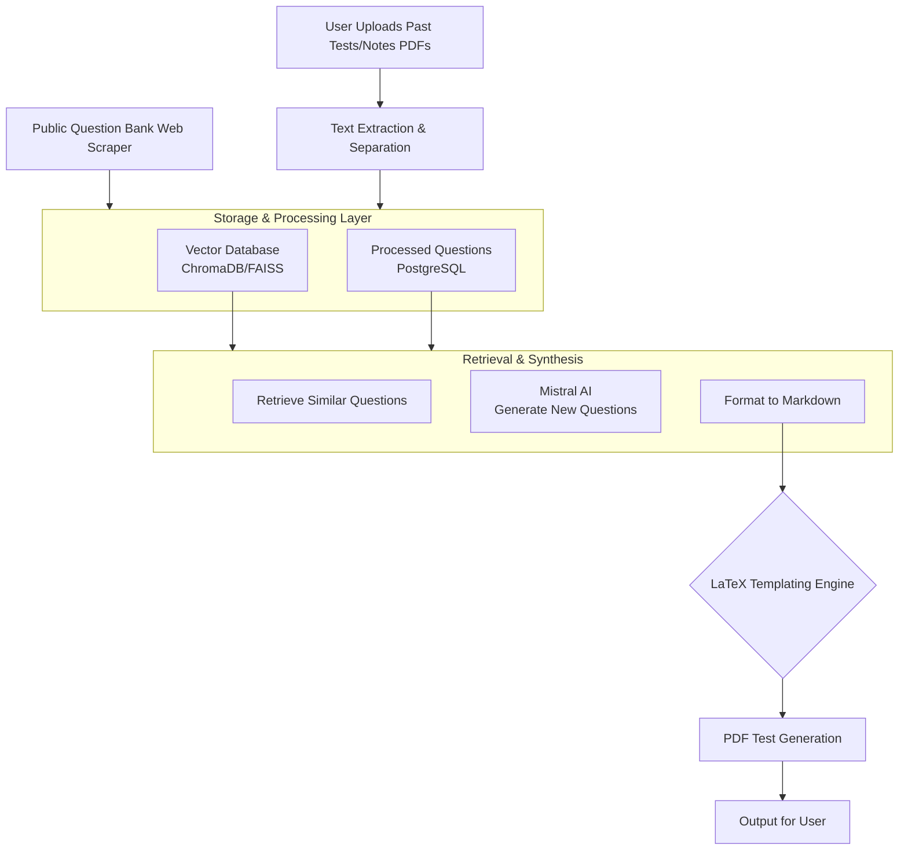

# MistralAIExamsGenerationApp
Instead of creating questions by yourself for an Exam let the App do this for you!

To Use the App go to the frontend link down the page after running docker. 

You can chat with the Bot on your Documents(Slides and Exams) and also generate how many new Exams you want so you can study better!

## Features:
 - File uplaoding
 - Document AI Chat
 - Exame Generation
 - Slides/Notes + Exams separation for better perfomance and accuracy


## App workflow



## Docker Build & Run Instructions

1. **Build the Docker image:**

   From the `frontend` directory:
   ```sh
   docker build -t mistral-exam-app .
   ```

2. **Run the container:**

   ```sh
   docker run -p 3000:3000 -p 8000:8000 mistral-exam-app
   ```
   - Frontend: http://localhost:3000
   - Backend/API: http://localhost:8000

3. **Environment Variables:**
   - Create a `.env` file in the same directory as your Dockerfile with:
     ```
     MISTRALAI_API_KEY=your_actual_api_key_here
     ```
   - The Dockerfile copies this `.env` file into the container.

---

## Stack:
 - Reflex (Frontend Framework) + FastAPI (backend)

## Improvements:
- 

